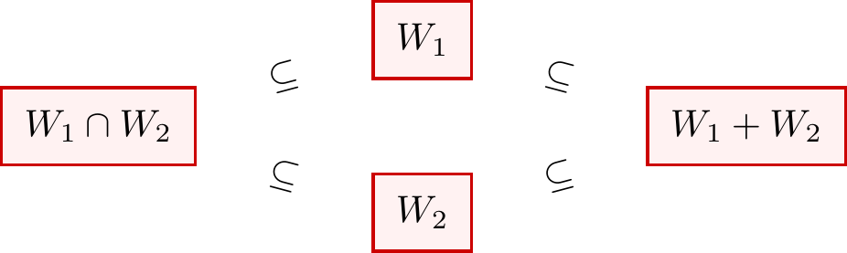

# Sums of Subspaces

In the previous sections, we studied intersections and unions of subspaces. While the intersection of two subspaces is always a subspace, the union typically is not. This raises a natural question: what is the "right" way to combine two subspaces into a larger one?

The answer is the **sum** of subspaces. Given two subspaces \( W_1 \) and \( W_2 \), their sum \( W_1 + W_2 \) consists of all vectors that can be written as \( \w_1 + \w_2 \) for some \( \w_1 \in W_1 \) and \( \w_2 \in W_2 \). This construction always yields a subspace—in fact, it is the smallest subspace containing both \( W_1 \) and \( W_2 \).

A particularly nice situation occurs when \( W_1 \) and \( W_2 \) have only the zero vector in common. In this case, their sum is called a **direct sum**, and every vector in the sum can be decomposed uniquely into a piece from \( W_1 \) and a piece from \( W_2 \). Direct sums are fundamental in decomposing vector spaces into simpler, independent components.

## Definition and Properties

::: {#def-sum-of-subspaces}

[Sum of Subspaces]

Let \( W_1 \), \( W_2 \) be subspaces of a vector space \( V \). Then we define
\[
    W_1 + W_2 \coloneqq \left\{ \w_1 + \w_2 : \w_1 \in W_1 \text{ and } \w_2 \in W_2 \right\}.
\]

:::

::: {#thm-subapce-sum-theorem}

[Sum of Subspaces Theorem]

\( W_1 + W_2 \) is a subspace of \( V \). Furthermore, this is the smallest subspace containing both \( W_1 \) and \( W_2 \).

:::

::: {.proof}

To prove that \( W_1 + W_2 \) is a subspace \( V \). We prove that three conditions of the subspace test:

- Non-emptiness: As \( W_1 \), \( W_2 \) are subspaces, they both contains \( \mathbf{0} \). And since \( \mathbf{0} = \mathbf{0}_{W_1} + \mathbf{0}_{W_2} \), therefore \( W_1 + W_2 \) is non-empty.

- Closed under addition: Let \( \a, \b \in W_1 + W_2 \). Then we have
    \[
        \begin{dcases}
            \a = \w_1 + \w_2, & \text{ for some } \w_1 \in W_1, \w_2 \in W_2 \\
            \b = \w_1' + \w_2', & \text{ for some } \w_1' \in W_1, \w_2' \in W_2 \\
        \end{dcases}
    \]
    Then \( \a + \b = \underbrace{(\w_1 + \w_1')}_{\in W_1} + \underbrace{(\w_2 + \w_2')}_{W_2} \in W_1 + W_2 \). So \( W_1 + W_2 \) is closed under addition.

- Closed under scalar multiplication: Let \( \a \in W_1 + W_2 \), and \( \lambda \in F \). Then we have \( \a = \w_1 + \w_2 \) for some \( \w_1 \in W_1, \w_2 \in W_2 \). Then \( \lambda \a = \underbrace{\lambda \w_1}_{\in W_1} + \underbrace{\lambda \w_2}_{\in W_2} \in W_1 + W_2 \). So \( W_1 + W_2 \) is closed under scalar multiplication.

This concludes that \( W_1 + W_2 \) is a subspace.

To prove that \( W_1 + W_2 \) is the smallest subspace containing both \( W_1 \) and \( W_2 \), we first prove that it actually contains \( W_1 \) and \( W_2 \), then we prove that it is the smallest subspace of \( V \) containing so.

- Containment: Since \( W_1 \) and \( W_2 \) are subspaces, they both contain the zero vector \( \mathbf{0} \). Since for any \( \w_1 \in W_1 \), we can write \( \w_1 = \w_1 + \mathbf{0} \), by \( \mathbf{0} \in W_2 \), we have \( \w_1 \in W_1 + W_2 \). Thus \( W_1 \subseteq W_1 + W_2 \). The same logic applies to \( W_2 \) therefore \( W_2 \subseteq W_1 + W_2 \).

- Minimality: Let \( U \) be any subspace of \( V \) such that \( W_1 \subseteq U \) and \( W_2 \subseteq U \). We want to show that \( W_1 + W_2 \subseteq U \). Take any element \( W_1 + W_2 \). By definition \( \v = \w_1 + \w_2 \) for some \( \w_1 \in W_1 \) and \( \w_2 \in W_2 \). Because \( W_1 \subseteq U \), then \( \w_1 \in U \). Similarly, because \( W_2 \subseteq U \), then \( \w_2 \in U \). At last, since \( U \) is a subspace, it is closed under addition. Therefore
    \[
        \w_1 + \w_2 \in U \implies \v \in U.
    \]
    This concludes that \( W_1 + W_2 \) is the smallest subspace of \( V \) containing \( W_1 \) and \( W_2 \).

:::

## Dimension of \( W_1 + W_2 \)

::: {#thm-dimension-formula-subspace-dim}

[Dimension Formula of Subspace Sum]

Let \( V \) be a finite-dimensional vector space, and let \( W_1 \), \( W_2 \) subspaces of \( V \). Then
\[
    \dim(W_1 + W_2) = \dim (W_1) + \dim (W_2) - \dim(W_1 \cap W_2).
\]

:::

::: {.proof}

::: {.content-visible when-format="html"}
{width="70%"}
:::

We use the above diagram to build intuition for the proof.

Let \( n = \dim(W_1 \cap W_2) \). Let \( B = \{ \b_1, \dots, \b_n \} \) be a basis of the intersection \( W_1 \cap W_2 \).

Since \( B \) is a linearly independent subset of both \( W_1 \) and \( W_2 \), by the Basis Extension Theorem (@thm-basis-extension), we can extend it to form bases for both subspaces:

1. **For \( W_1 \)**: Extend \( B \) with \( \{ \s_1, \dots, \s_p \} \) such that \( B_1 = \{ \b_1, \dots, \b_n, \s_1, \dots, \s_p \} \) is a basis of \( W_1 \). Note that \( \dim(W_1) = n + p \).

2. **For \( W_2 \)**: Extend \( B \) with \( \{ \t_1, \dots, \t_q \} \) such that \( B_2 = \{ \b_1, \dots, \b_n, \t_1, \dots, \t_q \} \) is a basis of \( W_2 \). Note that \( \dim(W_2) = n + q \).

::: {.claim}
The set \( S = \{ \b_1, \dots, \b_n, \s_1, \dots, \s_p, \t_1, \dots, \t_q \} \) is a basis of \( W_1 + W_2 \).
:::

::: {.proof}
- \( S \) spans \( W_1 + W_2 \)

    Let \( \w \in W_1 + W_2 \). By definition, \( \w = \w_1 + \w_2 \) for some \( \w_1 \in W_1, \w_2 \in W_2 \).
    Since \( B_1 \) spans \( W_1 \) and \( B_2 \) spans \( W_2 \), both \( \w_1 \) and \( \w_2 \) can be written as linear combinations of vectors in \( S \). Thus, their sum \( \w \) is also in \( \Span(S) \).

- \( S \) is Linearly Independent

    Consider a linear combination of vectors in \( S \) equal to the zero vector:
    \[
        \sum_{i=1}^n \alpha_i \b_i + \sum_{j=1}^p \beta_j \s_j + \sum_{k=1}^q \gamma_k \t_k = \mathbf{0}
    \]{#eq-linear-combo}

    Rearrange the equation to isolate the terms involving \( \t_k \):
    \[
        \v \coloneqq \sum_{i=1}^n \alpha_i \b_i + \sum_{j=1}^p \beta_j \s_j = - \sum_{k=1}^q \gamma_k \t_k
    \]

    Observe the vector \( \v \). From the LHS, we have \( \v \in W_1 \). From the RHS, we have \( \v \in W_2 \). Therefore, \( \v \in W_1 \cap W_2 \).

    Since \( \v \in W_1 \cap W_2 \), it can be written uniquely as a linear combination of the basis \( B \) of the intersection:
    \[
        \v = \sum_{i=1}^n \delta_i \b_i
    \]

    Equating this with the RHS expression of \( \v \):
    \[
        \sum_{i=1}^n \delta_i \b_i = - \sum_{k=1}^q \gamma_k \t_k \implies \sum_{i=1}^n \delta_i \b_i + \sum_{k=1}^q \gamma_k \t_k = \mathbf{0}.
    \]

    The set \( B_2 = \{ \b_1, \dots, \b_n, \t_1, \dots, \t_q \} \) is a basis of \( W_2 \) and is therefore linearly independent. This forces all coefficients to be zero. Specifically, all \( \gamma_k = 0 \).

    Substitute \( \gamma_k = 0 \) back into @eq-linear-combo:
    \[
        \sum_{i=1}^n \alpha_i \b_i + \sum_{j=1}^p \beta_j \s_j = \mathbf{0}
    \]

    Since \( B_1 = \{ \b_1, \dots, \b_n, \s_1, \dots, \s_p \} \) is a basis of \( W_1 \), it is linearly independent. This forces all \( \alpha_i = 0 \) and all \( \beta_j = 0 \).

Since all \( \alpha, \beta, \gamma \) are zero, \( S \) is linearly independent.
:::

Use dimension counting, since \( S \) is a basis for \( W_1 + W_2 \):
\begin{align*}
\dim (W_1 + W_2) &= |S| \\
&= n + p + q \\
&= (n + p) + (n + q) - n \\
&= \dim(W_1) + \dim(W_2) - \dim(W_1 \cap W_2).
\end{align*}
:::

::: {.remark}

**Counter-example for 3 Subspaces**

It is a coincidence that this formula resembles the "Inclusion-Exclusion Principle" from set theory. This intuition fails for three or more subspaces. The formula:
\begin{align*}
    \dim (W_1 + W_2 + W_3) &\neq \sum \dim(W_i) - \sum \dim (W_i \cap W_j) + \dim (W_1 \cap W_2 \cap W_3)
\end{align*}

**Counter-example**: Consider three distinct lines through the origin in \( \mathbb{R}^2 \) (e.g., x-axis, y-axis, and \( y=x \)).

- LHS: The sum of three lines fills the plane, so dimension is **2**.
- RHS: \( 1+1+1 - (0+0+0) + 0 = 3 \).

Since \( 2 \neq 3 \), the formula is false.

:::

## Direct Sum of Two Subspaces

::: {#def-direct-sum}

[Direct Sum of Two Subspaces]

Let \( W_1 \), \( W_2 \) be subspaces of a vector space \( V \). If \( W_1 \cap W_2 = \{ \mathbf{0} \} \), then we write \( W_1 + W2 \) as
\[
    W_1 \oplus W_2
\]
and call it the **direct sum** of \( W_1 \) and \( W_2 \).
:::

::: {#exm-direct-sum-of-matrix}
Consider the vector space \( V = M_n (\nC) \), and two of its subspaces:

- \( W_1 = \{ \A \in M_n (\nC) : \A^{\top} = \A \} \) (the subspace of symmetric matrices);

- \( W_2 = \{ \A \in M_n (\nC) : \A^{\top} = - \A \} \) (the subspace of skew-symmetric matrices).

We can derive that \( V = W_1 \oplus W_2 \).

*Proof.* We first show that \( V = W_1 + W_2 \). That is, any square matrix is a sum of a symmetric matrix and a skew-symmetric matrix. Let \( \A \in M_n (\nC) \), notice that we have the identity:
\[
    \A = \frac{1}{2} (\A + \A^{\top}) + \frac{1}{2} (\A - \A^{\top})
\]
where the first term is symmetric and the second term is skew-symmetric. Therefore, any square matrix is a sum of a symmetric matrix and a skew-symmetric matrix.

To establish that \( W_1 \cap W_2 = \{ \O \} \), let \( \A \in W_1 \cap W_2 \). By definition, this implies \( \A \in W_1 \) and \( \A \in W_2 \). Consequently, the identities \( \A = \A^{\top} \) and \( \A = - \A^{\top} \) must hold simultaneously. Substituting the former into the latter yields \( \A = - \A \). This implies \( 2\A = \O \), and thus \( \A = \O \).
:::
